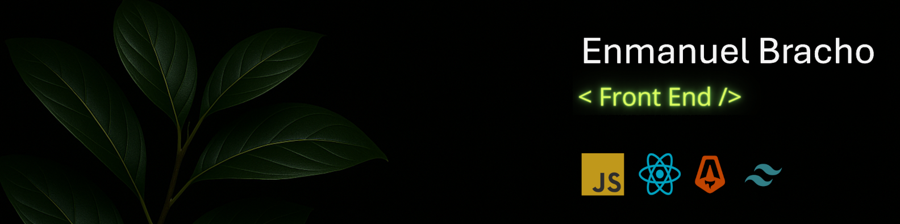

<header>
    <h1 align="center"> 👋 ¡Hola, soy Enmanuel! </h1>
    
Soy estudiante de Ingeniería en Sistemas en UNEFA y me especializo en el desarrollo front-end 💻✨.

</header>

    Como anécdota personal para romper el hielo: desde niño me ha encantado la tecnología, en parte debido a mi curiosidad por lo nuevo y lo desconocido 🔍🚀. Recuerdo aquellos días en la escuela, cuando mis compañeros y yo jugábamos con las configuraciones de las notebooks (Canaimas) del gobierno. Gracias a ellas tuve mi primer acercamiento a Linux, ¡y fue también mi primera laptop personal! 🧑‍💻

    A veces algo se descontrolaba y tenía que encontrar la solución. Nada muy avanzado, pero para los adultos que me rodeaban era algo impresionante 😅. Claro, luego si no sabían usar la impresora o el internet fallaba, llamaban al niño para que lo arreglara... creo que me salió un poco contraproducente.

## Habilidades y herramientas 💻

* **Lenguajes:** JavaScript, TypeScript, HTML, CSS.
* **Frameworks / Librerias:** React [React DOM Router, React Hook Form], Astro, Tailwind CSS. (Próximamente Next.JS).
* **Herramientas:** VS code, pnpm, git, vite.
* **OS:** Windows 10.

## Conéctate conmigo 💬
Me encantaría saber de ti. ¡No dudes en contactarme!

* **Email:** enmanuelbracho.dev@gmail.com
* **Linkedin:** [Enmanuel Antoni Bracho Villanueva](https://www.linkedin.com/in/enmanuel-antoni-bracho-villanueva/)
